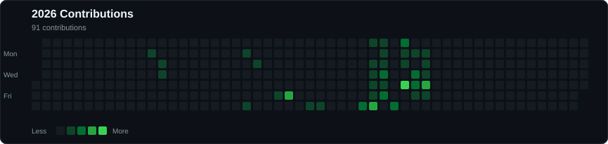

<h1 align="left">
  Hi there, I'm Muthukumaran Suresh
  
</h1>

I am a developer and AI/ML specialist passionate about building autonomous systems, agentic architectures, and solving complex problems through data-driven engineering.

---

### ⚡ Technical Arsenal

**Languages & Frameworks**

 

**Databases & Backend**

 

**Tools & Infrastructure**

 

---

### 🔭 Current Endeavors

| Project / Role | Description |
| :--- | :--- |
| 🚀 **RymeGateway** | **CEO & Founder.** Building production-grade AI infrastructure for routing LLM traffic across multiple providers with intelligent routing, authentication, billing, usage analytics, and developer-focused AI tooling. |
| 🗣️ **Accessibility AI** | Developing an AI/ML-driven speech training platform designed to assist individuals who stutter. |
| 🛰️ **Smart Infrastructure** | Designing a road hazard detection system leveraging satellite imagery and crowdsourced data for public safety. |

---

### 📊 GitHub Analytics

  

  

---

### 🔥 2026 GitHub Contribution Calendar

  

  🟩 Live contribution activity • 2026

---

### 📫 Connect With Me

  

  

  

